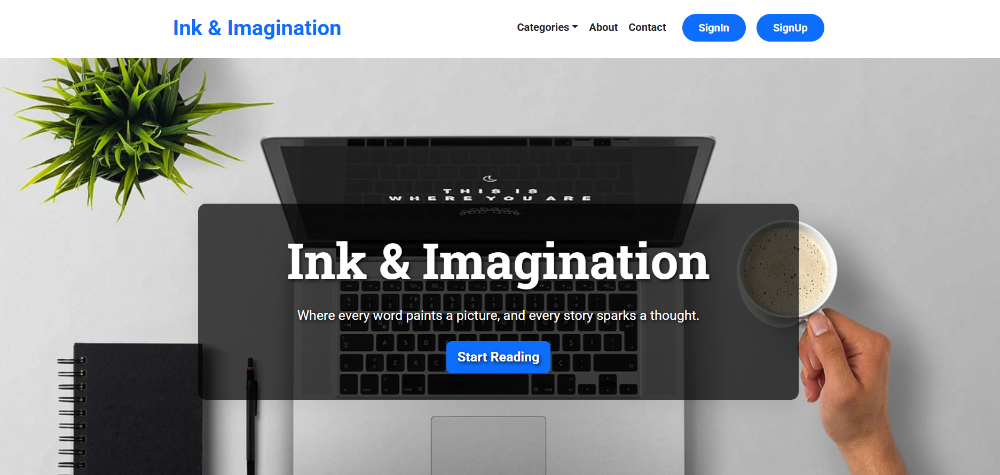
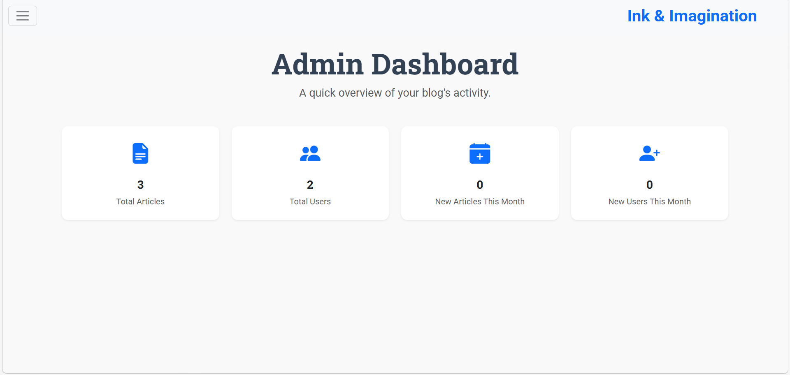
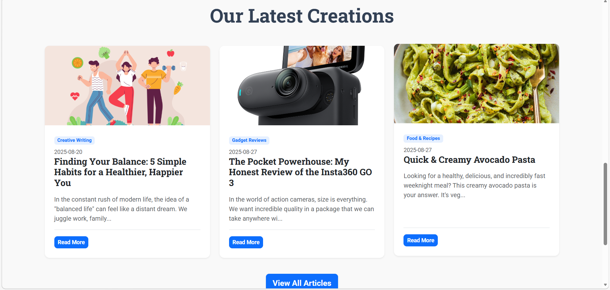

# 🖋️ Ink & Imagination
> **A high-performance MERN stack blogging platform for modern creators.**


Ink & Imagination is a full-stack web application designed for creators. It combines a sophisticated writing experience with a robust administrative backend, allowing for seamless content management and audience insights.

---

## 🚀 Live Demo
🚀 **[View Live Project](https://ink-and-imagination.onrender.com)** *(Status: Deploying...)*

---

## 📸 Project Previews

| **Main Landing Page** | **Admin Dashboard** |
| :---: | :---: |
|  |  |

| **Dynamic Content Feed** |
| :---: |
|  |

---

## ✨ Key Features
* **Rich Text Editor:** Integrated **CKEditor 5** for a professional writing interface.
* **Administrative Suite:** A dedicated dashboard for monitoring user growth and statistics.
* **Full CRUD Operations:** Comprehensive API for Creating, Reading, Updating, and Deleting posts.
* **Secure Auth:** JWT-based authentication with Bcrypt password hashing.
* **Responsive UI:** Fully optimized for mobile, tablet, and desktop using **Bootstrap CSS**.

---

## 🛠️ Tech Stack
* **Frontend:** React.js, Vite, Axios, Bootstrap
* **Backend:** Node.js, Express.js
* **Database:** MongoDB Atlas (Mongoose ODM)
* **Tools:** Dotenv, JSON Web Tokens (JWT)

---

## ⚙️ Installation & Setup

### 1. Prerequisites
Ensure you have **Node.js** and **npm** installed on your machine.

### 2. Clone the Repository
```bash
git clone [https://github.com/Sunidhi-source/my-blogging.git](https://github.com/Sunidhi-source/my-blogging.git)
cd my-blogging

### 3. Backend Configuration
Navigate to the backend folder and install the necessary dependencies:
```bash
cd backend
npm install express mongoose dotenv cors jsonwebtoken bcryptjs
# To start the server in development mode:
npm start

### Frontend (`/frontend/.env`)
```env
VITE_API_URL=http://localhost:3000
VITE_IMAGE_SRC=http://localhost:3000/public/
```
---

## 📜 Professional Highlights

> **This project serves as a comprehensive demonstration of full-stack engineering principles, focusing on the following core competencies:**

* **🛠️ API Architecture:** Developed a **robust RESTful API** with structured error handling, middleware integration, and secure route protection.
* **🗄️ Database Design:** Engineered **complex data schemas** using Mongoose to ensure data integrity and efficient document relationships.
* **🔐 Security Implementation:** Integrated **industry-standard security practices**, including JWT authentication, environment variable isolation, and Bcrypt password hashing.
* **💻 UI/UX Engineering:** Successfully integrated specialized libraries like **CKEditor 5** into a React workflow while maintaining **full responsiveness** and state synchronization.
* **📈 Scalability & State Management:** Built with **modularity** in mind, utilizing advanced React hooks to handle complex data flow across the MERN stack.

---
**Developed by Sunidhi Sharma**
